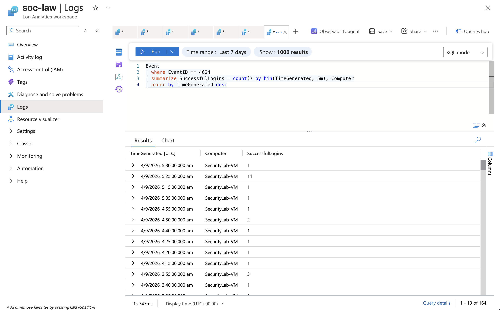
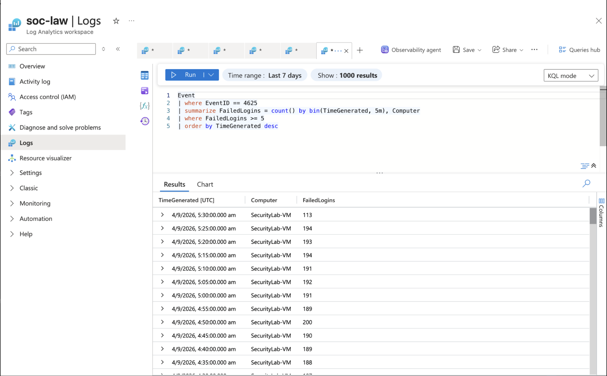
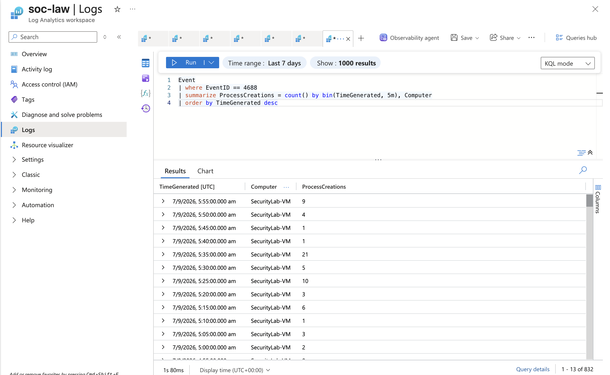
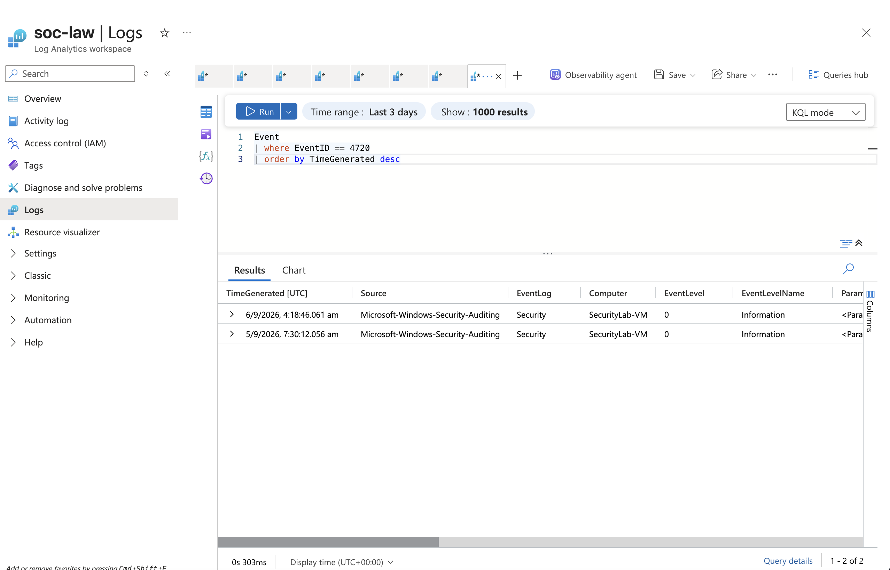

# Azure SOC Security Monitoring Lab

A hands-on Security Operations Center (SOC) monitoring lab built in
Microsoft Azure to collect, investigate, and visualize Windows security
events.

This project demonstrates practical SOC analyst activities including
authentication monitoring, failed login investigation, process creation
monitoring, account activity investigation, KQL query development,
detection engineering, and security event visualization.

------------------------------------------------------------------------

## Project Overview

The objective of this lab is to simulate common SOC analyst workflows by
collecting Windows security events from an Azure-hosted Windows Virtual
Machine and investigating those events using Azure Monitor, Log
Analytics Workspace, Microsoft Sentinel, and KQL.

The lab includes monitoring and investigation of:

-   Successful authentication activity
-   Failed authentication attempts
-   Repeated failed login activity
-   Failed login investigation
-   Failed logins followed by successful logins
-   Process creation activity
-   User account creation
-   Account lockout events

Security events generated by the Windows Virtual Machine are collected
through the Azure Monitor Agent and sent to a Log Analytics Workspace
for investigation and analysis.

------------------------------------------------------------------------

## Technologies Used

-   Microsoft Azure
-   Azure Virtual Machine
-   Azure Monitor Agent
-   Log Analytics Workspace
-   Microsoft Sentinel
-   Kusto Query Language (KQL)
-   Azure Monitor Workbooks
-   Windows Security Event Logs

------------------------------------------------------------------------

## Lab Architecture

``` text
Windows Virtual Machine
        |
        v
Windows Security Events
        |
        v
Azure Monitor Agent
        |
        v
Log Analytics Workspace
        |
        v
Microsoft Sentinel
        |
        v
KQL Queries and Security Investigation
        |
        v
Azure Monitor Workbook Dashboard
```

------------------------------------------------------------------------

## Security Events Monitored

  Event ID   Security Event         Monitoring Purpose
  ---------- ---------------------- --------------------------------------------
  4624       Successful Logon       Monitor successful authentication activity
  4625       Failed Logon           Investigate failed authentication attempts
  4688       Process Creation       Monitor process execution activity
  4740       Account Lockout        Detect locked user accounts
  4720       User Account Created   Monitor new user account creation

------------------------------------------------------------------------

# Security Monitoring and Investigation

## 1. Successful Logins - Event ID 4624

Successful Windows authentication events are monitored using Event ID
`4624`.

This investigation helps identify successful user logons and analyze
authentication activity over time.

### KQL Query

``` kql
Event
| where EventID == 4624
| summarize SuccessfulLogins = count() by bin(TimeGenerated, 5m), Computer
| order by TimeGenerated desc
```

### Monitoring Fields

Where available, the following fields can be investigated:

-   TimeGenerated
-   Computer
-   TargetUserName
-   SubjectUserName
-   IpAddress
-   WorkstationName
-   LogonType

### Screenshot



------------------------------------------------------------------------

## 2. Failed Logins - Event ID 4625

Failed Windows authentication events are monitored using Event ID
`4625`.

This investigation helps identify repeated failed login attempts and
potential suspicious authentication activity.

### KQL Query

``` kql
Event
| where EventID == 4625
| summarize FailedLogins = count() by bin(TimeGenerated, 5m), Computer
| where FailedLogins >= 5
| order by TimeGenerated desc
```

### Monitoring Fields

Where available, the following fields can be investigated:

-   TimeGenerated
-   Computer
-   TargetUserName
-   IpAddress
-   WorkstationName
-   FailureReason
-   Status
-   SubStatus
-   LogonType

### Screenshot



------------------------------------------------------------------------

## 3. Failed Login Investigation - Event ID 4625

Failed authentication events can be investigated in more detail by
extracting and reviewing authentication-related fields from the Windows
Security event data.

This investigation focuses on identifying who was targeted, where the
authentication attempt originated, how the logon was attempted, and why
the authentication failed.

### Investigation Fields

-   TargetUserName
-   TargetDomainName
-   WorkstationName
-   IpAddress
-   LogonType
-   Status
-   SubStatus
-   FailureReason
-   Computer
-   TimeGenerated

### Screenshot


------------------------------------------------------------------------

## 4. Brute Force Detection - Repeated Failed Logins

Repeated failed authentication activity can indicate password guessing
or brute-force behavior.

This detection summarizes failed logon activity over time and helps
identify unusually high volumes of failed authentication attempts.

### Investigation Focus

-   Number of failed attempts
-   Time window of the activity
-   Targeted user accounts
-   Affected computer
-   Source IP addresses
-   Authentication patterns over time

### Screenshot


------------------------------------------------------------------------

## 5. Failed Login Followed by Successful Login

This detection correlates failed logon events with successful logon
events for the same monitored system.

The investigation helps identify situations where multiple
authentication failures are followed by a successful authentication
within a defined time window.

This pattern can be useful for investigating potential password guessing
followed by a successful login.

### Correlated Events

-   Event ID `4625` - Failed Logon
-   Event ID `4624` - Successful Logon

### Investigation Fields

-   FailedTime
-   SuccessTime
-   Computer
-   TargetUserName
-   FailedIpAddress
-   SuccessIpAddress
-   FailedLogonType

### Screenshot


------------------------------------------------------------------------

## 6. Process Creation Monitoring - Event ID 4688

Windows process creation events are monitored using Event ID `4688`.

Process creation monitoring helps SOC analysts investigate programs and
processes executed on monitored systems.

### KQL Query

``` kql
Event
| where EventID == 4688
| summarize ProcessCreations = count() by bin(TimeGenerated, 5m), Computer
| order by TimeGenerated desc
```

### Monitoring Fields

Where available, the following fields can be investigated:

-   TimeGenerated
-   Computer
-   NewProcessName
-   ParentProcessName
-   SubjectUserName

### Screenshot



------------------------------------------------------------------------

## 7. Account Lockouts - Event ID 4740

Windows account lockout events are monitored using Event ID `4740`.

This investigation helps identify accounts that have been locked after
repeated authentication failures or suspicious login activity.

### KQL Query

``` kql
Event
| where EventID == 4740
| order by TimeGenerated desc
```

### Monitoring Fields

Where available, the following fields can be investigated:

-   TimeGenerated
-   Computer
-   TargetUserName
-   SubjectUserName
-   WorkstationName

### Screenshot

No dedicated account lockout screenshot is currently included in the
repository.

------------------------------------------------------------------------

## 8. User Account Creation - Event ID 4720

Windows user account creation events are monitored using Event ID
`4720`.

This investigation helps identify newly created user accounts and
supports detection of unauthorized account creation.

### KQL Query

``` kql
Event
| where EventID == 4720
| order by TimeGenerated desc
```

### Monitoring Fields

Where available, the following fields can be investigated:

-   TimeGenerated
-   Computer
-   TargetUserName
-   SubjectUserName

### Screenshot



------------------------------------------------------------------------

# KQL Detection Queries

The `queries` directory contains KQL queries used to investigate Windows
security events collected in the Log Analytics Workspace.

The current core queries include:

-   `queries/successful-logins.kql` --- monitors successful Windows
    logon events using Event ID `4624`.
-   `queries/failed-logins.kql` --- monitors failed authentication
    attempts using Event ID `4625`.
-   `queries/process-creation.kql` --- monitors Windows process creation
    activity using Event ID `4688`.
-   `queries/account-lockouts.kql` --- monitors Windows account lockout
    events using Event ID `4740`.
-   `queries/account-created.kql` --- monitors new Windows user account
    creation using Event ID `4720`.

Additional investigation and detection queries demonstrated in the
repository screenshots include brute-force detection, detailed
failed-login investigation, and failed-to-successful-logon correlation.

------------------------------------------------------------------------

# SOC Investigation Fields

During investigations, the following security event fields are analyzed
where available:

  Field               Investigation Purpose
  ------------------- --------------------------------------------------
  TimeGenerated       Determine when the event occurred
  Computer            Identify the affected system
  TargetUserName      Identify the targeted user account
  SubjectUserName     Identify the account responsible for the action
  IpAddress           Investigate the source IP address
  WorkstationName     Identify the source workstation
  LogonType           Determine the type of authentication
  FailureReason       Investigate why authentication failed
  Status              Review the authentication status code
  SubStatus           Review additional authentication failure details
  NewProcessName      Identify the process that was created
  ParentProcessName   Identify the parent process

------------------------------------------------------------------------

# Example SOC Investigation Workflow

1.  Security events are generated on the Windows Virtual Machine.
2.  The Azure Monitor Agent collects Windows security events.
3.  Events are sent to the Log Analytics Workspace.
4.  Microsoft Sentinel provides security monitoring and investigation
    capabilities.
5.  KQL queries are used to filter and investigate specific Event IDs.
6.  Analysts review relevant event fields and identify suspicious
    patterns.
7.  Authentication events can be correlated to investigate repeated
    failures followed by successful logons.
8.  Azure Monitor Workbook visualizations provide a graphical view of
    security activity.

------------------------------------------------------------------------

# Skills Demonstrated

-   Security Monitoring
-   Security Event Analysis
-   Alert and Event Triage
-   Windows Event Log Analysis
-   Authentication Investigation
-   Failed Login Investigation
-   Brute Force Detection
-   Authentication Event Correlation
-   Account Activity Monitoring
-   Process Creation Monitoring
-   KQL Query Development
-   Microsoft Azure
-   Azure Monitor
-   Azure Monitor Agent
-   Log Analytics Workspace
-   Microsoft Sentinel
-   Security Dashboard Development
-   Azure Monitor Workbooks

------------------------------------------------------------------------

# Project Structure

``` text
Azure-soc-security-monitoring-lab/
│
├── docs/
│   └── detections.md
│
├── queries/
│   ├── successful-logins.kql
│   ├── failed-logins.kql
│   ├── process-creation.kql
│   ├── account-lockouts.kql
│   └── account-created.kql
│
├── screenshots/
│   ├── Brute force detection.png
│   ├── Failed login inv.png
│   ├── Failed-to-successlogon.png
│   ├── Successful-logins.png
│   ├── account-created.png
│   ├── failed-logins.png
│   ├── newuser.png
│   └── process-creation.png
│
└── README.md
```

------------------------------------------------------------------------

# Key Learning Outcomes

Through this project, I gained practical experience in:

-   Collecting Windows security events in Azure
-   Configuring centralized log collection
-   Querying security logs using KQL
-   Investigating successful and failed authentication events
-   Detecting repeated failed login activity
-   Correlating failed and successful authentication events
-   Monitoring process creation activity
-   Investigating account-related security events
-   Working with Microsoft Sentinel and Log Analytics
-   Creating security monitoring visualizations
-   Understanding SOC analyst investigation workflows

------------------------------------------------------------------------

# Future Improvements

Potential future improvements for this project include:

-   Creating Microsoft Sentinel analytics rules
-   Configuring automated security alerts
-   Adding incident response workflows
-   Integrating additional Windows Event IDs
-   Creating advanced detection queries
-   Adding threat hunting queries
-   Enriching events with additional investigation context
-   Creating more advanced Azure Monitor Workbooks
-   Automating detection and alert workflows

------------------------------------------------------------------------

## Author

**Pavan Kumar**

Aspiring SOC Analyst focused on Security Monitoring, SIEM Investigation,
Windows Event Analysis, Microsoft Sentinel, Azure Security, and KQL.
